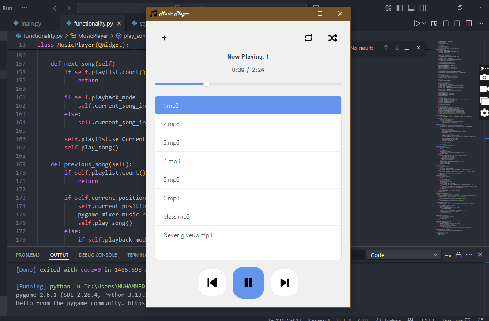
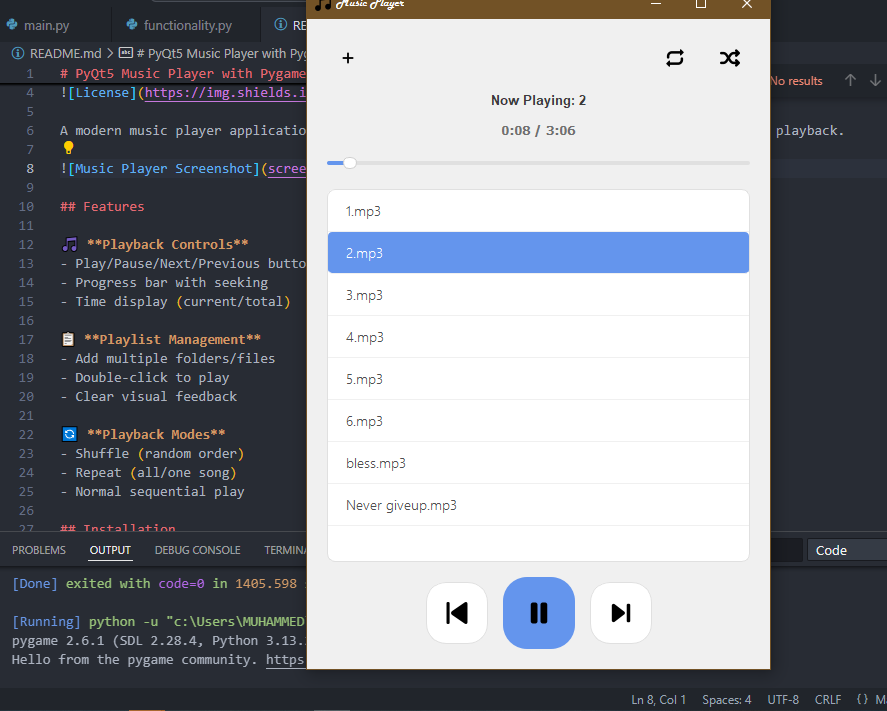

# Music Player

A modern, simple, and elegant music player built using Python and PyQt5 for the GUI, with optional use of Pygame for audio playback.





## Features

🎵 **Playback Controls**
- Play/Pause/Next/Previous buttons
- Progress bar with seeking
- Time display (current/total)

📋 **Playlist Management**
- Add multiple folders/files
- Double-click to play
- Clear visual feedback

🔄 **Playback Modes**
- Shuffle (random order)
- Repeat (all/one song)
- Normal sequential play

## Installation

1. Clone the repository:
```bash
git clone https://github.com/abu-muhammedx7/music-player.git
cd music-player
pip install -r requirements.txt
python main.py
